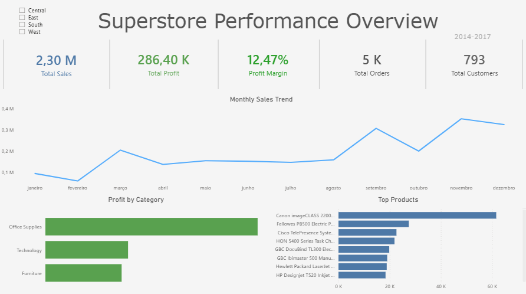
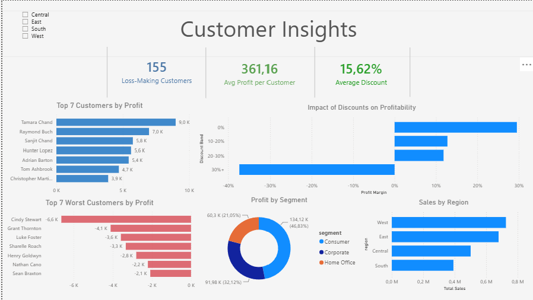
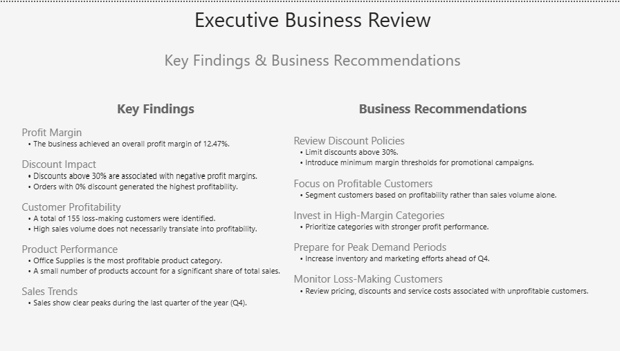
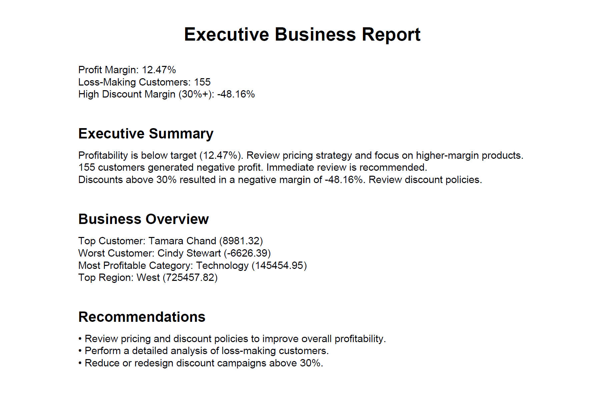

# Superstore Sales & Profitability Analysis

## Project Overview

This project analyzes retail sales performance using SQL, Power BI, and Python.

The objective was to identify sales trends, customer profitability, discount impact, and business opportunities through data analysis, interactive dashboards, and automated business reporting.

---

## Tools Used

* PostgreSQL
* SQL
* Power BI
* DAX
* Python
* Pandas
* ReportLab
* Data Cleaning
* Business Intelligence
* Data Visualization

---

## Dashboard Pages

### Executive Overview

### Customer Insights

### Executive Business Review

---

## Python Business Analytics

Using Python and Pandas, the project automatically calculates:

* Total Sales
* Total Profit
* Profit Margin
* Loss-Making Customers
* Discount Performance
* Customer Profitability

Custom functions were developed to generate:

* Executive Summary
* Business Recommendations
* Automated Business Insights
* Executive PDF Report

---

## Key Findings

* Profit Margin: 12.47%
* Loss-Making Customers: 155
* High Discount Margin (30%+): -48.16%
* Top Customer: Tamara Chand
* Worst Customer: Cindy Stewart
* Most Profitable Category: Technology
* Top Region: West

---

## Business Recommendations

* Review discount policies above 30%.
* Focus on customer profitability rather than sales volume alone.
* Reduce loss-making customer segments.
* Increase investment in high-performing categories.
* Replicate successful strategies from top-performing regions.

---

## Automated Executive Report

The project automatically generates an executive PDF report using ReportLab.

The report includes:

* KPI Summary
* Executive Summary
* Business Overview
* Strategic Recommendations

---

## Machine Learning Profit Prediction

As part of the project, Machine Learning models were developed to predict profit using historical sales data.

### Features Used

* Sales
* Discount
* Quantity
* Product Sub-Category

### Models Tested

| Model                            |   MAE |
| -------------------------------- | ----: |
| Linear Regression                | 69.77 |
| Linear Regression + Sub-Category | 67.73 |
| Random Forest                    | 24.41 |

### Key Findings

* Random Forest significantly outperformed Linear Regression.
* Sales was the most important predictor of profitability.
* Discount was the second most important predictor.
* Product Sub-Category provided additional predictive power.
* Customer Segment did not provide meaningful improvement.

### Business Impact

The final Random Forest model reduced prediction error by approximately 65% compared to the baseline Linear Regression model and demonstrated how Machine Learning can support profitability forecasting and business decision-making.

---

## Skills Demonstrated

* SQL Querying
* Data Cleaning
* Data Analysis
* Dashboard Development
* KPI Creation
* Business Reporting
* Python Automation
* Data Storytelling
* Business Intelligence

---

## Future Enhancements

### Phase 3 – AI Business Insights

Generate automated business insights from KPI results.

### Phase 4 – Machine Learning Profit Prediction

Predict profitability using historical sales data with Scikit-Learn.

---

## Author

Duarte Silva

Aspiring Data Analyst focused on SQL, Power BI, Python, and Business Analytics.
